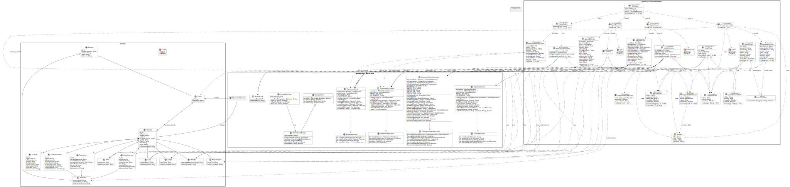

## Archivos Listos

 - Login
 - Register
## Que hay que revisar

 - En El repositorioDeObjetosMedicos, no se guardan las medicinas

# APP Registro Veterinario

Este es un proyecto de Kotlin Multiplatform, en el que hemos creado una aplicacion de Veterinaria
para que las personas puedan llevar un historial de recetas medicas de sus mascotas ,
entre otras cosas mas.
---

## Registro Veterinario

### Requisitos Tecnicos de la aplicacion
En el siguiente trabajo se creará un sistema que permita registrar mascotas domesticas más comunes
en los hogares las cuales serán: perros, gatos, conejos, hámsters y aves domésticas, cada una de
estas mascotas tendrán sus atributos principales como: nombre, edad, fecha de nacimiento, genero,
especie, raza y peso. También cada uno de ellos podrá tener algunos atributos propios de cada tipo
de mascota.

En la aplicación cada mascota tendrá un registro veterinario por separado y detallado de:
- Registro de vacunas: aquí cada vez que sea vacunada la mascota quedara registrada con: nombre,
  tipo, cantidad de dosis, fecha de vacunación, nombre del veterinario y observaciones generales. El
  sistema generará un historial cronológico de cada vacuna que se le administre a la mascota, que
  permitirá al usuario revisar fácilmente cuándo recibió la última dosis y qué vacunas están
  pendientes.

- Registro controles veterinarios: Almacena información sobre consultas, chequeos o revisiones
  periódicas realizadas a nuestras mascotas por los veterinarios, en cada control se registrará:
  fecha de la consulta, motivo del control, recomendaciones entregadas, necesidad de examen,
  de ser así se registrará cantidad de examen y nombre de los exámenes solicitados.

- Registro de tratamientos o recetas: donde cada vez que un veterinario emita un tratamiento o
  receta, el sistema almacenará: Nombre del tratamiento, razón del tratamiento,
  nombre de medicamentos, dosis de cada medicamento, frecuencia del medicamento,
  duración del tratamiento, nombre del veterinario y observaciones.

- Registro de incidentes: El sistema permitirá registrar de manera independiente cualquier incidente
  relevante que haya ocurrido en la vida de la mascota como: accidentes, intervenciones
  quirúrgicas u otros. Cada uno de estos llevara: nombre, fecha, tipo de incidente,
  descripción, gravedad y observaciones.

Por otro lado, el sistema también permitirá mantener un registro de veterinarios, a los cuales
el dueño puede recurrir, donde cada veterinario tendrá: nombre, especialidad (ya sea en aves,
en perros, gatos o general), contacto, email, dirección, horario de atención y descripción
del servicio que ofrece (vacunas, control general, cirugías menores, emergencias, etc.), este
registro de veterinarios permitirá vincular cada vacuna, tratamiento o consulta con el
profesional que atendió a la mascota, a su vez también se deberá de mantener los datos guardados
de manera local, las mascotas deben de estar asociadas a un dueño el que deberá de tener un id,
nombre, teléfono, email y direccion. De esta manera cada dueño podrá tener de manera ordenada y detallada
toda la información correspondiente a su mascota.
